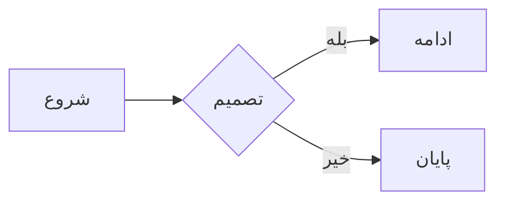

# راهنمای مارک‌داون در پارسی‌نگار

به پارسی‌نگار خوش آمدید! این راهنما به شما کمک می‌کند تا با استفاده از تمام قابلیت‌های نشانه‌گذاری موجود، متن‌های زیبا و ساختاریافته‌ای بنویسید.

## نشانه‌گذاری‌های استاندارد مارک‌داون

پارسی‌نگار از تمام سینتکس‌های استاندارد مارک‌داون پشتیبانی می‌کند. در ادامه به موارد پرکاربرد اشاره می‌شود.

### عناوین (Headings)

برای ایجاد عناوین از `#` استفاده کنید. تعداد `#` سطح عنوان را مشخص می‌کند.

```markdown
# عنوان سطح ۱
## عنوان سطح ۲
### عنوان سطح ۳
```

### تاکید (Emphasis)

- **پررنگ کردن:** متن را بین دو ستاره قرار دهید: `**متن پررنگ**`
- *کج کردن:* متن را بین یک ستاره قرار دهید: `*متن کج*`
- ~~خط زدن:~~ متن را بین دو مدک قرار دهید: `~~متن خط‌خورده~~`

### لیست‌ها (Lists)

#### لیست نامرتب
از `-`، `*` یا `+` در ابتدای هر خط استفاده کنید.

```markdown
- آیتم اول
- آیتم دوم
  - آیتم تودرتو
```

#### لیست مرتب
از اعداد به همراه نقطه استفاده کنید.

```markdown
۱. آیتم اول
۲. آیتم دوم
۳. آیتم سوم
```
**نکته:** می‌توانید از اعداد فارسی نیز استفاده کنید و پارسی‌نگار به طور خودکار آن‌ها را تشخیص می‌دهد.

### پیوند و تصویر

- **پیوند (Link):** `[متن پیوند](https://example.com)`
- **تصویر (Image):** ``

### نقل‌قول (Blockquote)

برای ایجاد نقل‌قول، از علامت `>` در ابتدای خط استفاده کنید.

```markdown
> این یک نقل‌قول است.
```

### کد (Code)

- **کد تک‌خطی (Inline):** کد را بین یک بک‌تیک قرار دهید: `` `console.log("Hello");` ``
- **بلوک کد (Fenced):** کد را بین سه بک‌تیک قرار دهید و می‌توانید زبان آن را نیز مشخص کنید.

````markdown
```javascript
function greet() {
  console.log("Hello, World!");
}
```
````

### بازبینه (Task List)

لیست کارهای خود را به سادگی ایجاد کنید.

```markdown
- [x] کار انجام شده
- [ ] کار باقی‌مانده
```

---

## نشانه‌گذاری‌های پیشرفته (ویژه پارس‌نشان)

پارسی‌نگار با استفاده از مفسر «پارس‌نشان» قابلیت‌های بیشتری را برای زبان فارسی فراهم می‌کند.

### برجسته کردن (Highlight)

برای برجسته کردن یک بخش از متن، آن را بین دو علامت مساوی قرار دهید.

```markdown
این یک متن ==بسیار مهم== است.
```
**نتیجه:** این یک متن <mark>بسیار مهم</mark> است.

### جعبه‌های توضیحی (Admonitions)

برای جلب توجه خواننده به نکات خاص، از جعبه‌های توضیحی استفاده کنید.

**سینتکس:**
```markdown
...نوع جعبه
محتوای جعبه در اینجا قرار می‌گیرد.
...
```

**انواع موجود:**

- **توجه (note):**
  ```markdown
  ...توجه
  این یک پیام برای جلب توجه است.
  ...
  ```
- **هشدار (warning):**
  ```markdown
  ...هشدار
  این یک پیام هشدار است.
  ...
  ```
- **نکته (tip):**
  ```markdown
  ...نکته
  این یک نکته مفید است.
  ...
  ```
- **مهم (important):**
  ```markdown
  ...مهم
  این یک نکته بسیار مهم است.
  ...
  ```
- **احتیاط (caution):**
  ```markdown
  ...احتیاط
  این یک پیام احتیاط است.
  ...
  ```

### شعر

برای نمایش اشعار با قالب‌بندی کلاسیک، از بلوک `...شعر` استفاده کنید. هر مصرع را در یک خط جداگانه بنویسید. خطوط خالی بین ابیات فاصله ایجاد می‌کنند.

```markdown
...شعر
بنی آدم اعضای یکدیگرند
که در آفرش ز یک گوهرند

چو عضوی به درد آورد روزگار
دگر عضوها را نماند قرار
...
```

## نمودارها و دیاگرام‌ها

### نمودارهای Mermaid.js

شما می‌توانید انواع نمودارها (فلوچارت، توالی، گانت و...) را با استفاده از سینتکس Mermaid.js رسم کنید. کافی است کد خود را در یک بلوک کد با زبان `mermaid` قرار دهید.

````markdown

````

### نقشه‌ذهنی (Mind Map)

برای ایجاد نقشه‌ذهنی، از بلوک `...نقشه‌ذهنی` استفاده کنید. هر آیتم را با `-` مشخص کرده و با ایجاد تورفتگی (دو فاصله) زیرشاخه‌ها را تعریف کنید.

```markdown
...نقشه‌ذهنی
- پارسی‌نگار
  - ویژگی‌ها
    - پشتیبانی از فارسی
    - نمایش زنده
  - فناوری
    - HTML/CSS
    - JavaScript
...
```

## کلیدهای میانبر

برای مشاهده لیست کامل کلیدهای میانبر موجود در برنامه، از منوی **راهنما > راهنمای کلیدها** یا کلید ترکیبی `Ctrl + Alt + K` استفاده کنید.