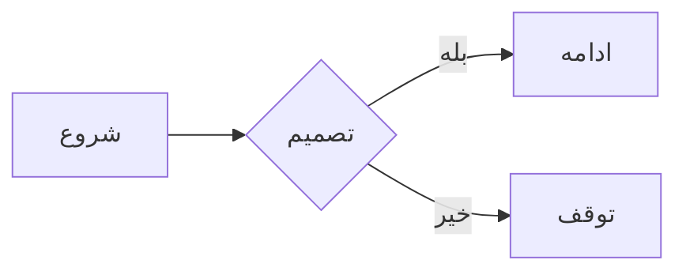

**توجه:** در نوشتن پرامپت‌ها تلاش کردم تا مثل یک کاربر عادی که دانش فنی نداره رفتار کنم.

# دستیار هوش مصنوعی v0

## پرامپت ۱
ویرایشگر markdown

لطفا یک ویرایشگر markdown که در مرورگر اجرا میشه و با زبان‌های RTL مثل فارسی سازگار باشه ایجاد کن. این ویرایشگر باید شامل ویژگی‌های زیر باشه:
1. شامل دو بخش اصلی باشه، در بخش سمت راست کاربر بتونه markdown را بنویسه که اسمش رو می‌زاریم بخش نوشتن و در بخش سمت چپ خروجی چیزی که نوشته را ببینه که اسم این بخش رو هم می‌زاریم نمایش.
2. این امکان وجود داشته باشه که بتونم از مفسری (markdown parser and compiler) که می‌خوام برای نمایش markdown استفاده کنم.
3. در بخش نوشتن یک نوار بالای اون باشه که ویژگی‌های زیر را داشته باشه.
 - پررنگ کردن (bold)
 - کج کردن (italic)
 - عنوان (Heading)
 - خط زدن (strike)
 - لیست نامرتب (unorder list)
 - لیست مرتب (order list)
 - چک لیست (cheklist)
 - نقل‌قول (blockquote)
 - کد (code)
 - جدول (table)
 - عکس (image)
 - پیوند (link)
4. در بخش نمایش هم یک گزینه برای گرفتن خروجی (export) باشه و شامل دو گزینه باشه یکی به صورت فایل markdown و دیگری به صورت html

## پرامپت ۲
لطفا بخش نمایش را سمت چپ قرار بده و بخش نوستن را سمت راست

## پرامپت ۳
لطفا تغییرات زیر را اعمال کن:
1. متن «ویرایشگر مارک‌داون» را حذف کن
2. به جای واژه خروجی در دکمه‌های بخش نمایش آیکون ابزار و اندازه فونت را کمی کوچکتر کن.
3. اندازه ویرایشگر تمام صفحه باشه

## پرامپت ۴
می‌تونی این پروژه با جاوااسکریپت بزنی بدون استفاده از react؟

## پرامپت ۵
لطفا تغییرات زیر را اعمال کن:
1. بخش انتخاب مفسر را به نوار ابزار بخش نوشتن منتقل کن و برچسبش رو حذف کن و لیست انتخاب باشه
2. برای ابزارها می‌خوام به جای اسم‌شون از آیکون‌ها استفاده کنم مثل اون چیزی که در react بود.
3. می‌خوام فونت پروژه به وزیر متن تغییر کنه آدرسش مخزن گیت‌هاب فونت این هست: https://github.com/rastikerdar/vazirmatn

## پرامپت ۶
تغییرات زیرا اعمال کن:
1. گزینه انتخاب مفسر را حذف کن و بجاش بخش تنظیمات را اضافه کن که آیکونش چرخ‌دنده باشه. با انتخاب این گزینه یک صفحه باز میشه که کاربر می‌تونه یکسری تنظیمات را بر روی ویرایشگر اعمال کنه.
2. در بخش تنظیمات گزینه انتخاب مفسر را اضافه کن.
3. در بخش تنظیمات قابلیت انتخاب فونت اضافه کن. لیست فونت‌ها شامل وزیر‌متن، Iranian sans، آراد و بهداد
آدرس گیت هاب فونت آراد: https://github.com/MDarvishi5124/Arad
آدرس گیتن‌هاب فونت بهداد: https://github.com/font-store/BehdadFont
4. در بخش تنظیمات گزینه تم را اضافه کن تا کاربر بتونه بین تم سیاه (dark theme) و تم روشن یکی را انتخاب کنه.
  - باید استایل تم سیاه را هم بزنی.
5. در بخش تنظیمات نمایش تعداد خطوط را اضافه کن. با فعال کردن این گزینه در بخش نوشتن به ازای هر خط (line) یک عدد نمایش داده میشه.
6. در بخش انتهایی (پایین صفحه) ویرایشگر با اندازه فونت ۱۲ موارد زیر را نمایش بده:
  - نویسه (تعداد کاراکترهای موجود در فایل)
  - حروف (تعداد حروف موجود در فایل)
  - واژه‌ها (تعداد واژه‌های موجود در فایل)
  - خط (تعداد خط‌های موجود در فایل)
  - حجم (حجم فایل)
7. با اسکرول کردن هر یک از بخش‌های نوشتن یا نمایش متناظر با اون بخش مقابلش هم اسکرول بشه.

## پرامپت ۷
تغییرات زیر را اعمال کن:
1. بخش آمار را تمام صفحه کن، و فاصله آمارهای نمایش داده شده را به هم نزدیک‌تر کن.
2. با کمی اسکرول کردن صفحه به صورت خودکار با یک انیمیشن آهسته اسکرول میشه که نباید اینطوری باشه.
3. نمایش تعداد خطوط به درستی با خط‌ها یکی نیست و در یک راستا قرار ندارند.

## پرامپت ۸
1. بخش آمار تمام صفحه نشده و فقط در بخش نوشتن نمایش داده میشه، منظورم از نمام صفحه اینه که در هر دو بخش نوشتن و نمایش نمایش داده بشه. (اما دقت کن آمارهای نمایش داده شده همون سمت راست باقی ‌بمونن)
2. در بخش آمار، گزینه‌های نمایش داده شده از سمت راست شروع بشن و فاصله هم کمتر بشه.
3. متاسفانه مشکل اسکرول وجود داره و با کمی جابجایی در به سمت پایین صفحه خود به خود بالا میره

## پرامپت ۹
1. در بخش آمار، اطلاعات نمایش داده شده باید سمت راست نمایش داده بشه ولی الان سمت چپه
2. در فایرفاکس با اسکرول کردن جابجایی در متن انجام نمیشه و اگر جابجایی انجام بشه به صورت خودکار متن بالا میره.
3. نمایش تعداد خطوط با خط‌ها درون بخش نمایش در یک راستا قرار ندارند.
4. با تغییر فونت در بخش تنظیمات فونت تغییر نمی‌کنه
5. این مفسر رو به لیست مفسرها در بخش تنظیمات اضافه کن. https://github.com/barnevis/ShahNeshan

## پرامپت ۱۰
1. آمار نمایش داده هنوز سمت چپ هست، باید از سمت شروع بشه
2. تغییر فونت‌ها هنوز هم انجام نمیشه، فقط فونت وزیرمتن کار می‌کنه
3. وقتی مفسر shahneshan را انتخاب می‌کنم. این پیام نمایش داده میشه: «مفسر ShahNeshan در دسترس نیست.»

## پرامپت ۱۱
1. فونت‌های «آراد» و «بهداد« از بخش فونت‌ها حذف کن
2. مفسر شه‌نشان هنوز کار نمی‌کنه
3. بخش نمایش آمار هنوز سمت چپه، باید به طور کامل منتقلش کنی سمت راست صفحه.

## پرامپت ۱۲
تغییراتی که برای نمایش بخش آمار دادی درست نبوده، فاصله اطلاعات نمایش داده شده نزدیکه و به سمت راست صفحه هم منتقل نشده.

## پرامپت ۱۳
فاصله‌ها در بخش آمار درست شده، اما محل قرارگیری درست نیست. بخش آمار باید زیر بخش نوشتن باشه یعنی گوشه سمت راست پایین صفحه ویرایشگر

## پرامپت ۱۴
بخش آمار باید تمام صفحه باشه نه اینکه فقط زیر بخش نوشتن باشه، یعنی هم باید زیر بخش نوشتن باشه هم بخش نمایش. حالت قبلی خوب بود و نباید تغییرش می‌دادی فقط تنها چیزی که باید تغییر بدی محل نمایش گزارش‌های آماری هست که باید از سمت راست صفحه شروع بشن.

## پرامپت ۱۴
خب من می‌خوام این پروژه‌ای که ایجاد کردی را در گیت‌هاب منتشر کنم. اول یک اسم خوب براش انتخاب و بعدش یک فایل readme بنویس که شامل بخش‌های زیر باشه:

- کارکرد پروژه را شرح بده و بگو که با استفاده از کمک خودت ایجاد شده و یک پیوند هم به آدرس خودت بده. در ضمن حتما مشخص کن این پروژه برای نوشتن markdown با زبان فارسی درست شده.
- ویژگی‌های پروژه را بنویس (به صورت کلی نیاز به توضیح نیست)
- نحوه استفاده از پروژه را بنویس
- یک مجوز متن‌باز هم با نظر خودت انتخاب کن.

## پرامپت ۱۵
تغییرات زیر را اعمال کن:
1. عنوان نمایش داده در تب مرورگر به «پارسی‌نگار - ویرایشگر markdown» تغییر کنه.
2. در بخش نمایش واژه «نمایش» را حذف کن.
3. در بخش نوشتن با کلید ترکیبی ctrl+z عملیات undo انجام بهش و با کلید ترکیبی ctrl+y عملیات redo انجام بشه. در بخش ابزارها هم آیکون‌ها رو هم اضافه کن. (محل قرارگیرشون کنار آیکون تنظیمات باشه با یک خط جداکننده)
4. در بخش نوشتن خطی cursor در اون قرار داره هایلایت بشه. (در هر دو تم این مورد رو لحاظ کن)

## پرامپت ۱۶
مواردی که پیاده‌سازی کردی یکسری مشکل دارن:
1. باید جای آیکون‌های ازنو و واگرد را عوض کنی.
2. دکمه‌های ازنو و واگرد در نوار ابزار کار نمی‌کنن.
3. هایلات خطی cursor در اون قرار داره درست کار نمی‌کنه.

## پرامپت ۱۷
در تغییراتی که اعمال کردی مشکلات زیر بوجود اومده:
1. محل نمایش گزارش‌های آماری باید از سمت راست صفحه شروع بشن. اما دوباره منتقل‌شون سمت چپ که اشتباه است.
2. مشکل هایلات هنوز وجود داره و اگر به خط‌های پایینی بری دیگه هایلایت انجام نمیشه.

## پرامپت ۱۸
زمانی که cursor از خط عبور می‌کنه، هایلات در خط هفت باقی می‌مونه. بعد از اینکه cursor در خط ۱۰ هست هایلات در خط ۸ هست. یعنی بعد از خط ۷ هایلات دو خط از cursor عقبه.

## پرامپت ۱۹
متاسفانه مشکل بر طرف نشده، مشکل دیگه‌ای که هم هست بعد از ۲۰ خط دیگه هایلایت نمایش داده نمیشه.

## پرامپت ۲۰
مشکل نمایش هایلات در انتهای فایل بر طرف شده اما مشکل عقب بودن هایلایت از cursor بعد از خط هفت هنوز وجود داره.

## پرامپت ۲۱
با تغییراتی که اعمال کردی هایلایت دو خط از cursor جلو هست.

## پرامپت ۲۲
در انتهای بخش تنظیمات موارد زیر را اضافه کن.
1. شماره نسخه به صورت پیوند (link) نوشته بشه و به آدرس https://github.com/alirho/parsiNegar/releases پیوند داده بشه
2. آیکون گیت‌هاب را قرار بده و به آدرس https://github.com/alirho/parsiNegar پیوند بده

دقت کن این موارد باید در وسط و انتهای بخش تظیمات نمایش داده بشه.

## پرامپت ۲۳
در بخش تنظیمات فونت‌های «آراد» و «بهداد» دوباره اضافه شدند که باید حذف بشند. و با انتخاب فونت iranian sans فونت تغییری نمی‌کنی

## پرامپت ۲۴
متاسفانه مشکل تغییر فونت Iranian Sans بر طرف نشده

## پرامپت ۲۵
ویژگی‌های زیر را اضافه کن:
1. اگر در ابتدای خط نویسه فارسی وارد شد خط از سمت راست شروع بشه و اگر نویسه انگلیسی بود خط از سمت چپ شروع بشه. این ویژگی در هر دو بخش نوشتن و نمایش اعمال بشه.
2. نویسه‌های جفت را به صورت خودکار ببند. نویسه‌هایی مثل پرانتز، کروشه، []، ""، ''، <> ، `` و {}
3. در بخش نوار ابزار با زدن هر یک از یک دکمه‌ها در بخش نوشتن با اضافه شدن المان markdown یک متن هم هست که باید حذف بشه. به طور مثال باز دن دکمه عنوان، واژه عنوان به # اضافه می‌شه که باید حذف بشه و خود # به تنهایی باید نمایش داده بشه.

## پرامپت ۲۶
در ویژگی تشخیص خودکار متن که اضافه کردی باگ‌های زیر وجود داره:
1. زمانی یک خط با نویسه انگلیسی شروع میشه تمام بخش نوشتن چپ به راست میشه، در حالی که فقط باید همون یک خط چپ به راست باشه.
2. اگر در ابتدای یک خط از نویسه‌هایی مثل «دو نقطه»، «علامت تعجب» یا «» استفاده بشه و باقی خط به فارسی باشه خط را از چپ به راست نمایش می‌ده در حالیکه باید از راست به چپ نمایش بده. به نظرم بهتره که برای چپ به راست کردن یک متن فقط نویسه‌های انگلیسی را در نظر بگیری. این مورد را در هر دو بخش نمایش و نوشتن اعمال کن.

## پرامپت ۲۷
ویژگی‌های زیر را اضافه کن:
1. در بخش نمایش قابلیت «حالت نمایش» را اضافه کن. وقتی کاربر روی این دکمه کلیک کرد بخش نمایش تمام صفحه میشه. در این حالت ویرایش امکان پذیر نیست تا زمانی که کاربر دوباره روی دکمه کلیک کنه تا به حالت قبل برگرده.
2. امکان بارگذاری فایل از روی کامپیوتر. کاربر با کلیک بر روی یک دکمه بتونه فایل مورد نظرش را که قالب markdown داره رو انتخاب کنه تا اون فایل در پارسی‌نگار نمایش داده بشه.
3. زمانی که کاربر داره از لیست مرتب، لیست نامرتب و بازبینه (cheklist) استفاده می‌کنه با زدن enter مورد بعدی آماده وارد کردن و خط خالی نباشه. مثلا اگر کاربر در حال وارد کردن یک لیست نامرتب هست و مورد اول را وارد کرده با زدن enter نویسه - در ابتدای خط نمایش داده بشه تا بتونه مورد بعدی لیست نامرتب را وارد کنه و اگر در همون خط یک enter دیگه زد خط خالی باشه.

## پرامپت ۲۸
تغییرات زیر را براساس ویژگی‌هایی که اضافه کردی انجام بده:
1. دکمه حالت نمایش را به سمت راست بخش نمایش انتقال بده. دقت کن در همون نوار ابزار بخش نمایش باشه.
2. برای ادامه خودکار لیست‌ها زمانی که کاربر دوباره enter می‌زنه در همون خط باقی بمونه و به خط بعد نره. (یعنی نویسه‌ای که اضافه کردی مثل - رو باید حذف کنی)
3. در بخش ابزار نوشتن نام دکمه «چک لیست» رو به «بازبینه» تغییر بده
4. با وارد کردن نویسه‌هایی مثل - یا ( خط از سمت چپ شروع میشه در حالیکه باید از راست شروع بشه. باید به طور پیش‌فرض مکان نما سمت راست باشه مگر زمانی که کاربر نویسه انگلیسی وارد کرد.

## پرامپت ۲۹
1. در حالت نمایش برای خوانایی بهتر متن بهتره در سمت راست و چپ صفحه یک فضای خالی باشه تا در صفحه نمایش‌هایی که عرض زیادی دارند متن در کل صفحه پخش نشه.
2. با وارد کردن نویسه‌های انگلیسی خط از سمت چپ شروع نمیشه.

## پرامپت ۳۰
1. فضای خالی که در حالت نمایش اضافه کردی زیاد هست، کمترش کن.
2. مشکل نویسه‌های انگلیسی بر طرف نشده، زمانی در یک خط نویسه‌های انگلیسی هست، خط باید از سمت چپ شروع بشه. هم در هر دو بخش نوشتن و نمایش.

## پرامپت ۳۱
در بخش نوشتن زمانی که یک خط با نویسه‌های انگلیسی شروع میشه کل بخش نوشتن چپ به راست می‌شه در حالی که باید فقط همون خط از چپ صفحه شروع بشه. یک مشکل دیگه‌ای که هم وجود داره اینکه وقتی نویسه‌هایی غیر از فارسی و انگلیسی نوشته می‌شه (مثل -، (، ٪، # یا !) خط از سمت راست شروع میشه ولی اون نویسه سمت چپ هست و مکان‌نما سمت راست قرار می‌گیره که بعد از نوشتن درست میشه.

## پرامپت ۳۲
دوباره اگر یک خط با نویسه‌های انگلیسی نوشته بشه کل بخش نوشتن از سمت چپ صفحه نمایش داده می‌شه در حالیکه فقط باید همون یک خط از سمت چپ صفحه نمایش داده بشه. یعنی هر خط را باید جداگانه بررسی کنی که اگر نویسه انگلیسی داشت از سمت چپ صفحه نمایش داده بشه، اگر نویسه‌ای به غیر از انگلیسی داشت از سمت راست صفحه نمایش داده بشه.

## پرامپت ۳۳
با تغییراتی که ایجاد کردی دوتا مشکل بزرگ بوجود اومده.
1. در بخش نمایش هیچ چیز نمایش داده نمیشه
2. در بخش نوشتن با زدن دکمه enter کاربر به خط بعدی هدایت نمی‌شه.

## پرامپت ۳۴
مشکل نمایش هنوز بر طرف نشده، و مشکل جدید هم که بوجود اومده ادامه خودکار لیست‌ها کار نمی‌کنه.


# دستیار هوش مصنوعی bolt

## پرامپت ۲
تغییرات زیر را اعمال کن:
1. از آیکون‌های fontawsome استفاده کن
2. نوار ابزار بالا و نوار آمار پایین ثابت باشن و با اسکرول کردن جابجا نشن
3. دو واژه «ویرایشگر» و «پیش‌نمایش» حذف بشن.
4. رنگ نوار ابزار را هم به f3f4f6 تغییر بده

## پرامپت ۳
1. از مفسر marked استفاده کن
2. تغییر فونت‌ها در بخش تنظیمات کار نمی‌کنه. باید با تغییر فونت در بخش تنظیمات فونت در ویرایشگر تغییر کنه. فونت پیش‌فرض هم «وزیرمتن» باشه.
3. تغییر اندازه فونت در بخش تنظیمات کار نمی‌کنه

## پرامپت ۴
همگام‌سازی اسکرول، زمانی که کاربر در یکی از بخش‌های ویرایشگر متن را اسکرول می‌کند بخش دیگر هم همزمان با آن اسکرول شوند.

## پرامپت ۵
ویژگی‌های زیر را اضافه کن:
1. نویسه‌های جفت را به صورت خودکار ببند. نویسه‌هایی مثل پرانتز، کروشه، []، ""، ''، <> ، `` و {}
2. زمانی که در بخش نوشتن اسکرول می‌کنیم بخش پیش‌نمایش اسکرول نمی‌شه
3. آیکون تمام صفحه بخش پیش‌نمایش را در سمت وسط نوار ابزار (کمی متمایل به سمت بخش پیش‌نمایش) قرار بده
4. زمانی که بخش پیش‌نمایش تمام صفحه میشه از سمت راست و چپ صفحه کمی فاصله بده

## پرامپت ۶
1. در انتهای بخش تنظیمات موارد زیر را اضافه کن.
  - شماره نسخه به صورت پیوند (link) نوشته بشه و به آدرس https://github.com/alirho/parsiNegar/releases پیوند داده بشه
  - آیکون گیت‌هاب را قرار بده و به آدرس https://github.com/alirho/parsiNegar پیوند بده
2. قالب‌های تیره و سپیا رو هم پیاده‌سازی کن

## پرامپت ۷
تغییراتی که در بخش تنظیمات اعمال میشه رو در localstorage ذخیره کن و در ابتدای بارگذاری صفحه اگر موجود هست بازیابی کن.

## پرامپت ۸
1. در خروجی html قالبی که نمایش داده میشه باید شبیه به قالب پیش‌نمایش باشه.
2. امکان گرفت خروجی PDF هم اضافه بشه با قالب مشابه بخش پیش‌نمایش

## پرامپت ۹
زمانی که بخش پیش‌نمایش تمام صفحه میشه، دکمه‌های سمت راست نوار ابزار نمایش داده نشن و دکمه تمام صفحه به سمت راست نوار ابزار منتقل بشه. زمانی که کاربر دوباره دکمه تمام صفحه را زد ویرایشگر به حالت پیش‌فرض برگرده

## پرامپت ۱۰
زمان تمام صفحه شدن پیش‌نمایش دکمه‌های اشتباه رو داری حذف می‌کنی باید دکمه‌هایی که کلاس toolbar-left در فایل html دارن رو حذف کنی

## پرامپت ۱۱
در بخش پیش‌نمایش اگر نویسه ایتدایی a تا z و A تا Z بود نمایش خط را از سمت چپ شروع کن در غیر این صورت نمایش خط از سمت راست شروع بشه.

## پرامپت ۱۲
در اینجا return <p style="direction: ${direction}; text-align: ${direction === 'ltr' ? 'left' : 'right'}">${(text)}</p>; text باید خودش از مارکدان دوباره تبدیل شود تا درست نشان دهد.

## پرامپت ۱۳
در بخش تنظیمات امکان انتخاب نوع مفسر مارکدان را اضافه کن. مفسر جدید با cdn زیر به html اضافه شود: https://unpkg.com/shahneshan@1.0.12/dist/markdownParser.cjs.js
نام این مفسر shahneshan است.

## پرامپت ۱۴
1. در نوار آمار (پایین ویرایشگر) در بخش سمت چپ صفحه که خالی است. نام فایل نمایش داده بشه. فایلی هم که بارگذاری میشه نامش در اون قسمت نمایش داده بشه و امکان ویرایش هم در هر زمانی وجود داشته باشه. به صورت پیش‌فرض هم متن «نام فایل» نمایش داده بشه.

## پرامپت ۱۵
به صورت پیش‌فرض در بخش نوشتن فایل README.md داخل پروژه نمایش داده بشه.

## پرامپت ۱۶
ویژگی‌ای با نام میان‌بر نوشتاری اضافه کن. کاری که این ویژگی انجام می‌دهد این است که وقتی کاربر در محیط نوشتن نویسه‌ی / را تایپ می‌کند، یک لیست از میان‌برهای فرمت‌بندی مارک‌داون به او پیشنهاد داده شود. کاربر می‌تواند با کیبورد (کلیدهای جهت و Enter) یا با کلیک یکی از گزینه‌ها را انتخاب کند و متن مربوطه به‌طور خودکار در محل درج شود.
رفتار مورد انتظار:
با تایپ / در ویرایشگر، لیست زیر به همراه آیکون‌های آن‌ها ظاهر شود:
- عنوان
- عنوان دو
- عنوان سه
- پررنگ
- مورب
- نقل‌قول
- کد تک‌خطی
- کد چندخطی
- خط زده
- لیست نامرتب
- لیست مرتب
- بازبینه
- جدول
- تصویر
پیوند کاربر بتواند با تایپ ادامه‌ی عبارت (مثلاً /پررن) فیلتر انجام دهد و مثلاً فقط پررنگ را ببیند. با انتخاب یک گزینه، فرمت‌بندی معادل آن در محل مکان‌نما درج شود و / و هر چیزی که بعد از آن تایپ شده حذف شود. این ویژگی فقط در زمان تایپ / فعال شود و با Esc یا کلیک بیرون بسته شود.

## پرامپت ۱۷
ویژگی که اضافه کردی دو تا مشکل داره:
1. زمانی که لیست مرتب وارد میشه با زدن اینتر لیست ادامه پیدا می‌کنه، در حالیکه اگر کاربر دوبار اینتر بزنه لیست باید شکسته بشه و خط خالی باشه.
2. در وارد کردن بازبینه باز زدن اینتر لیست نامرتب نمایش داده میشه در حالیکه باید نویسه‌های مربوط به بازبینه (- [ ]) نمایش داده بشه.

## پرامپت ۱۸
هنوز مشکل لیست مرتب بر طرف نشده. زمانی که کاربر در لیست مرتب یک اینتر میزنه لیست باید ادامه پیدا کنه و اگر دو اینتر زد لیست باید شکسته بشه. مثل لیست نامرتب که پیاده‌سازی کردی.

## پرامپت ۱۹
در بالای ویرایشگر یک منوی افقی طراحی کن که شامل ۴ گزینه اصلی باشد: «فایل»، «نمایش»، «افزودن» و «راهنما». با قرار گرفتن نشان‌گر موس روی هرکدام از این گزینه‌ها، یک منوی بازشونده نمایش داده شود که شامل آیتم‌های زیر باشد:

1. فایل
  - فایل نو: با کلیک روی این گزینه تمام محتوای موجود در ویرایشگر پاک شود.
  - بارگذاری فایل: امکان بارگذاری فایل از سیستم کاربر فراهم شود (عملکرد این گزینه با دکمه بارگذاری فایل در نوار ابزار یکی باشد).
  - خروجی گرفتن: با قرار گرفتن روی این گزینه، یک زیرمنو شامل سه گزینه «Markdown»، «HTML» و «PDF» باز شود. با کلیک بر هر یک، محتوای ویرایشگر با فرمت مربوطه دانلود شود (همانند دکمه‌های خروجی در نوار ابزار).
2. نمایش
  - نوار ابزار: امکان نمایش یا مخفی‌سازی نوار ابزار
  - نوار آمار: امکان نمایش یا مخفی‌سازی نوار آماری پایین صفحه
  - فهرست: نمایش یا پنهان‌سازی فهرست هدینگ‌ها در صورت وجود
  - نام فایل: نمایش یا عدم نمایش نام فایل جاری
3. افزودن
  - عنوان
  - پررنگ
  - مورب
  - خط زده
  - لیست مرتب
  - لیست نامرتب
  - بازبینه (چک‌لیست)
  - نقل‌قول
  - کد
  - جدول
  - تصویر
  - پیوند
4. راهنما
  - راهنمای پارسی‌نگار: نمایش مستندات داخلی ابزار
  - راهنمای Markdown: ارجاع به راهنمای کامل نگارش Markdown

منو باید واکنش‌گرا، کاربردی و بدون استفاده از کتابخانه‌های بیرونی پیاده‌سازی شود. لطفاً با جاوااسکریپت خام (pure JavaScript) طراحی شود.

## پرامپت ۲۰
منوی افقی باید ثابت باشه، در حال حاضر با اسکرول کردن در بخش‌های نوشتن و پیش‌نمایش منو نمایش داده نمیشه.

## پرامپت ۲۱
تغییرات زیر اعمال کن:
1. دکمه تنظیمات را به انتهای منوی فایل اضافه کن
2. در منوها در کنار متن گزینه‌های منو آیکون‌های مناسب هم قرار بده.
3. دکمه تمام صفحه را از نوار ابزار حذف کن و به انتهای سمت چپ منو اضافه کن.

## پرامپت ۲۲
در حالت پیش‌فرض نوار ابزار نمایش داده نشه، کاربر اگر نیاز به نوار ابزار داشت می‌تونه از منوی نمایش اون را فعال کنه.

## پرامپت ۲۳
افزودن ویژگی فهرست مطالب (TOC) به ویرایشگر.

با فعال شدن گزینه "فهرست" در منوی "نمایش"، یک پنل فهرست مطالب در سمت راست ویرایشگر ظاهر شود. این پنل باید بین نوار آمار و منوی بالا قرار بگیرد و در حالت پیش‌نمایش تمام‌صفحه نیز نمایش داده شود.

ویژگی‌های فهرست مطالب:
1. عنوان‌ها (Headingها) از سطح ۱ تا ۶ از متن استخراج شوند و به صورت زیرمجموعه‌وار (hierarchical) در فهرست نمایش داده شوند.
2. با کلیک بر روی هر عنوان در فهرست، کاربر به همان بخش از متن منتقل شود (اسکرول خودکار به محل آن عنوان).
3. عنوان‌ها قابلیت جمع‌شوندگی و بازشدن داشته باشند؛ یعنی کاربر بتواند زیرمجموعه هر عنوان (مثلاً زیرعنوان‌های h2 یا h3) را مخفی یا نمایش دهد.
4. فهرست مطالب با هر بار تغییر در محتوا (افزودن، حذف یا ویرایش عنوان‌ها) به‌صورت زنده به‌روزرسانی شود.
5. در صورت غیرفعال کردن گزینه "فهرست"، این پنل از صفحه حذف شود.

**نکته:** پس از این پرامپت برخی اصلاحات در کد به صورت دستی اعمال شده است.

## پرامپت ۲۴
در پنل فهرست مطالب که در سمت راست ویرایشگر قرار دارد، مشکلی وجود دارد:
زمانی که کاربر در محتوای ویرایشگر اسکرول می‌کند، پنل فهرست مطالب هم همراه با آن اسکرول می‌شود، در حالی که باید موقعیت پنل فهرست مطالب ثابت بماند و فقط محتوای داخل آن در صورت نیاز اسکرول شود.

لطفاً این مشکل را برطرف کن به‌طوری‌که:
1. پنل فهرست مطالب همواره در جای ثابت خود در سمت راست صفحه باقی بماند.
2. محتوای داخل پنل (یعنی فهرست عنوان‌ها) در صورت زیاد بودن، داخل خودش اسکرول شود نه کل پنل.
3. این رفتار در همه حالت‌ها از جمله پیش‌نمایش تمام‌صفحه نیز به‌درستی عمل کند.

برای پیاده‌سازی این ویژگی از جاوااسکریپت خالص (pure JavaScript) و CSS استفاده شود.

## پرامپت ۲۵
تغییراتی که ایجاد کردی مشکل را حل نکرد و با اسکرول کردن در ویرایشگر متن‌های موجود در فهرست مطالب مانند متن‌های بخش نوشتن و پیش‌نمایش بالا و پایین می‌شوند. درحالیکه متن‌های موجود در فهرست مطالب باید ثابت باشند و به صورت جداگانه از دو پنل اصلی اسکرول بخوره

## پرامپت ۲۶
مشکل اسکرول حل شد، الان مشکل جدید که بوجود اومده این هست که در حالت پیش‌فرض ویرایشگر (نمایش دو بخش نوشتن و پیش‌نمایش) فهرست مطالب نمایش داده نمیشه.

**نکته:** برای حل مشکل ثابت بودن فهرست مطالب در زمان اسکرول کردن متن، تغییرات به صورت دستی ایجاد شده است.

# دستیار هوش Gemini 2.5 Pro

## پرامپت ۱
امکان استفاده از کتابخانه mermaidjs را اضافه کن. و رندر نمودارها را در بخش نمایش پشتیبانی بشه.

https://github.com/mermaid-js/mermaid

## پرامپت ۲
با انتخاب مفسر marked در بخش پیش‌نمایش متنی نمایش داده نمی‌شه و در کنسول مرورگر خطای زیر نمایش داده می‌شه.

```
script.js:314 Uncaught (in promise) TypeError: text.toLowerCase is not a function
Please report this to https://github.com/markedjs/marked.
at markedRenderer.heading (script.js:314:21)
at l.parse (marked.min.js:65:1819)
at parse (marked.min.js:65:1290)
at E.parse (marked.min.js:66:5622)
at Object.k (marked.min.js:67:238)
at parseMarkdown (script.js:357:21)
at updatePreview (script.js:711:25)
at HTMLSelectElement.<anonymous> (script.js:1000:5)
markedRenderer.heading @ script.js:314
parse @ marked.min.js:65
parse @ marked.min.js:65
(anonymous) @ marked.min.js:66
k @ marked.min.js:67
parseMarkdown @ script.js:357
updatePreview @ script.js:711
(anonymous) @ script.js:1000
```

## پرامپت ۳
حالا در کنسول هیچ خطایی نمایش داده نمیشه اما در بخش پیش‌نمایش تمامی متن‌ها به صورت [object Object] نمایش داده می‌شه.

## پرامپت ۴
مشکل نمایش بر طرف شده، اما مشکل تازه‌ای که وجود داره این هست که عنوان‌ها، لینک‌ها و تصاویر به صورت متن ساده نمایش داده می‌شوند نه فرمت‌بندی مارک‌دوان.

## پرامپت ۵
مشکل نمایش عکس‌ها و پیوند‌ها بر طرف شد، اما نمایش عنوان‌ها هنوز مشکل داره. عنوان در داخل تگ hundefined قرار گرفتن که باعث می‌شه در بخش نمایش به صورت یک متن ساده دیده بشن.
دقت کن که عنوان‌‌ها باید در تگ‌ها h1 تا h6 قرار بگیرن

## پرامپت ۶
گزینه نمودار را به بخش‌های زیر اضافه کن:
به منو «افزودن»
به منوی میان‌بر (shortcuts menu)
نوار ابزار (toolbar)
با زدن گزینه نمودار به صورت پیش‌فرض مقدار زیر نمایش داده بشه:



## پرامپت ۷
فایلی که کاربر در حال کار بر روی آن هست به صورت خودکار در indexedDB ذخیره بشه تا در مراجعه بعدی کاربر اطلاعات همون فایل بهش نمایش داده بشه.

دقت کن که ذخیره‌سازی باید به صورت خودکار انجام بشه.

## پرامپت ۸
در منو «نمایش» گزینه‌ای اضافه کن با نام «فایل‌ها» که لیست فایل‌های ذخیره شده در indexedDB کاربر را نمایش بده.
1. نحوه نمایش و ظاهرش مانند «فهرست مطالب» باشه
2. امکان دانلود (به صورت مارک‌دوان)، تغییر نام و حذف فایل از indexedDB در پنل نمایش داده شده وجود داشته باشه. (در زمان حذف از کاربر تاییدیه گرفته بشه)
3. در بخش تنظیمات هم گزینه‌ای برای پاک کردن indexedDB قرار بده. (هنگام پاک کردن به کاربر هشدار داده بشه)

## پرامپت ۹
در بخش فهرست «فایل‌ها» تغییرات زیر را اعمال کن:
1. گزینه‌‌های حذف، تغییر نام و دانلود را در یک منو قرار بده.
2. تاریخ و ساعت تغییر را از زیر نام فایل حذف کن و به صورت tooltip زمانی که کاربر ماوس را بر روی نام فایل قرار می‌ده نمایش بده.

## پرامپت ۱۰
در منوی «فایل» در بخش خروجی گرفتن گزینه‌ای اضافه کن تا کاربر بتونه تمام فایل‌های موجود در indexedDB را به صورت zip دانلود کنه.

## پرامپت ۱۱
در لیست فایل‌ها، فایلی که انتخاب شده متمایز دیگر فایل‌ها باشه.

## پرامپت ۱۲
اگر نمایش «فهرست مطالب» و «فایل‌ها» همزمان انتخاب شود، دو پنل کنار هم نمایش داده می‌شن که باعث می‌شه فضای زیادی از فضا صفحه گرفته بشه. برای نمایش فایل‌ها یک پنل در سمت راست باشه که در بالای اون دو تب وجود داشته باشه یکی برای فایل‌ها و دیگری برای فهرست مطالب که با کلیک بر روی هر کدوم اطلاعات اون تب نمایش داده بشه. در تب هم از آیکون استفاده کن.

## پرامپت ۱۳
زمانی که کاربر در بخش ویرایشگر اسکرول انجام میده پنل سمت راست هم اسکروا می‌خوره، و لیست فایل‌ها و فهرست مطالب دیگه نمایش داده نمی‌شه.

اسکرول فهرست مطالب و لیست فایل‌ها باید از اسکرول ویرایشگر جدا باشه.

## پرامپت ۱۴
مشکل بر طرف نشده و هنوز اسکرول پنل سمت راست و ویرایشگر یکی است.

## پرامپت ۱۵
مشکل اسکرول پنل سمت راست بر طرف شده، اما با تغییری که ایجاد کردی اسکرول همزمان بخش نوشتن و پیش‌نمایش بهم خورده و هر کدوم جداگانه اسکرول می‌شن. در حالیکه اسکرول این دو بخش باید همگام باشه.

## پرامپت ۱۶
برای تم‌های تیره و سپیا این بخش از کد css را هم اضافه کن: `side-panel-tab:hover`

## پرامپت ۱۷
اگر یک خط کد طولانی در بخش کد مارک‌دوان قرار بگیره، بخش پیش‌نمایش به اندازه آن خط کد عرض می‌گیره و عرض بخش نوشتن کاهش پیدا می‌کنه. بهتر است در این مواقع بخش کد اسکرول افقی بگیره تاکل متن بخش کد دیده بشه.

## پرامپت ۱۸
در کنار دکمه تمام صفحه دکمه جستجو را قرار بده که شامل ویژگی‌های زیر باشه:
1. امکان جستجوی یک عبارت (از یک نویسه تا بیشتر)
2. هایلایت کردن موارد یافته شده در هر دو بخش نوشتن و پیش‌نمایش
3. امکان پیمایش بین موارد یافت شده. (مورد فعال با رنگ متفاوت نمایش داده بشه)
4. وقتی جستجو تموم شد یا کاربر ورودی رو پاک کرد، تمام هایلایت‌ها پاک بشن.
5. با زدن دکمه‌های ctrl و f گزینه جستجو فعال بشه. با زدن دکمه esc گزینه جستجو بسته بشه.

## پرامپت ۱۹
مشکلات زیر را بر طرف کن:
1. متن‌ها در بخش نوشتن نمایش داده نمی‌شن تا زمانی که بخشی از آن را انتخاب کنی یا همه متن را با ctrl+A انتخاب کنی اونوقت نمایش داده می‌شه.
2. بخش searchbar زیر دکمه جستجو نمایش داده بشه.

## پرامپت ۲۰
در بخش جستجو امکان انتخاب محل جستجو را اضافه کن. کاربر باید بتونه بین جستجو در بخش «نوشتن» یا بخش «نمایش» یا هر دو بخش انتخاب کنه.

## پرامپت ۲۱
دکمه‌ای که برای محدوده جستجو قرار دادی کوچیکه و به خوبی قابل دیدن نیست.

## پرامپت ۲۲
در فرمت‌بندی کد، Syntax Highlighting را پیاده‌سازی کن.

## پرامپت ۲۳
در تم تیره Syntax Highlighting درست نمایش داده نمی‌شه.

## پرامپت ۲۴
در بخش نمایش کد چند خطی گزینه‌ای برای رونوشت (copy) در کلیپ‌بورد اضافه کن.

## پرامپت ۲۵
زمانی که بر روی دکمه رونوشت کد کلیک می‌کنم در مرورگر خطای زیر نمایش داده می‌شه:
```
Uncaught TypeError: Cannot read properties of undefined (reading 'writeText')
    at HTMLButtonElement.<anonymous> (script.js:1172:31)
```

## پرامپت ۲۶
به کدی که برای جست‌وجوی متن در یک ویرایشگر مارک‌داون نوشتی، قابلیت «جایگزینی» را هم اضافه کن.

شرایطی که باید رعایت شود:

1. دو input در نظر بگیر:
  - یکی برای عبارت جستجو (search input)
  - یکی برای عبارت جایگزین (replace input)

2. دکمه‌های زیر را به نوار ابزار جست‌وجو اضافه کن:
- Replace: فقط مورد انتخاب‌شده‌ی فعلی را با عبارت جایگزین، جایگزین کند.
 - Replace All: همه‌ی موارد یافت‌شده در متن را با عبارت جایگزین، جایگزین کند.

3. این قابلیت باید در یک `textarea` یا `contenteditable` اجرا شود، و تمرکز فعلاً فقط روی `textarea` است.
4. جایگزینی باید فقط زمانی انجام شود که مقدار `search` در متن وجود داشته باشد. 
5. در صورت امکان، بعد از Replace یا Replace All، فوکوس روی textarea حفظ شود و کاربر بتواند تایپ را ادامه دهد.
6. پشتیبانی از زبان فارسی (راست به چپ) و نویسه‌های یونیکد مانند «ی» و «ک» فارسی رعایت شود.
7. عملکرد Replace فقط مورد فعلی (بر اساس cursor) را جایگزین کند، نه همه‌ی موارد.
8. از highlight یا انتخاب متن در textarea استفاده شود تا جایگزینی دقیق انجام شود.

لطفاً فقط کدی بنویس که به کد جست‌وجو اضافه شود و عملکرد جایگزینی را کامل کند.

## پرامپت ۲۷
در پنل جستجو فیلد جایگزینی و دو دکمه مربوط به آن پایین فیلد جستجو قرار گیرند.

## پرامپت ۲۸
در فهرست فایل‌ها زمانی که ماوس بر روی گزینه حذف قرار می‌گیرد پس زمینه آن قرمز در تم‌های روشن و سپیا قرمز نمی‌شود. در تم تیره پس زمینه به درستی قرمز می‌شود.

## پرامپت ۲۹
اگر پنل جستجو باز باشد با کلیک بر روی آیکون جستجو پنل بسته نمی‌شود. در حالیکه باید با کلیک بر روی دکمه جستجو پنل بسته شود.

## پرامپت ۳۰
زمانی که ماوس بر روی دکمه جستجو یا تمام صفحه قرار می‌گیرد، رنگ پس‌زمینه هر دو دکمه تغییر می‌کند در حالیکه فقط باید رنگ دکمه‌ای تغییر کند که ماوس بر روی آن قرار دارد.

## پرامپت ۳۱
با انتخاب تم تیره متن‌های پیش‌فرض (placeholder) داخل فیلدهای پنل جستجو دیده نمی‌شود.

## پرامپت ۳۲
در منو راهنما، راهنمای استفاده از mermaidjs را اضافه کن.

## پرامپت ۳۳
زمانی که لیست تودرتو در بخش نوشتن وارد می‌کنم، در بخش نمایش هیچ چیز نمایش داده نمی‌شه و خطای زیر در کنسول مرورگر نمایش داده می‌شه:
```
Uncaught (in promise) Error: Token with "list" type was not found.
Please report this to https://github.com/markedjs/marked.
    parseInline https://cdn.jsdelivr.net/npm/marked/marked.min.js:66
    listitem http://0.0.0.0:8000/script.js:668
    list https://cdn.jsdelivr.net/npm/marked/marked.min.js:54
    parse https://cdn.jsdelivr.net/npm/marked/marked.min.js:65
    parse https://cdn.jsdelivr.net/npm/marked/marked.min.js:65
    parseMarkdown https://cdn.jsdelivr.net/npm/marked/marked.min.js:66
    k https://cdn.jsdelivr.net/npm/marked/marked.min.js:67
    parseMarkdown http://0.0.0.0:8000/script.js:748
    updatePreview http://0.0.0.0:8000/script.js:1138
    closeSearchBar http://0.0.0.0:8000/script.js:1564
```
نمونه لیست تودرتو:
- موردیک
- مورد دو
- مورد سوم
    - تودرتو یک
    - تودرتو دو
- مورد چهارم

## پرامپت ۳۴
قابلیت «ایجاد مایندمپ» (Mind Map) اضافه کن. لطفاً این ویژگی را بدون استفاده از MermaidJS یا Markmap پیاده‌سازی کن.

جزئیات مورد نیاز:

1. داده‌ی ورودی به صورت یک بلاک مارک‌داون است که با `...mindmap` شروع و با `...` پایان می‌یابد. ساختار آن به صورت لیست‌های تو در توست. برای مثال:
...mindmap
- ذهن
  - تفکر
  - احساس
    - شادی
    - ترس
...
2. از این ساختار، یک درخت داده (tree data structure) بساز و آن را به صورت بصری نمایش بده.
3. نمایش بصری باید دارای ویژگی‌های زیر باشد:
   - رسم از راست به چپ (RTL) برای هماهنگی با زبان فارسی
   - پشتیبانی از شاخه‌های دوطرفه (نه فقط از بالا به پایین یا چپ به راست)
   - استفاده از فونت فارسی مانند "Vazirmatn"
   - قابلیت زوم (Zoom) و جابجایی (Pan) با ماوس
   - طراحی ساده، مینیمال و واکنش‌گرا (responsive)
4. نمایش مایندمپ فقط در بخش پیش‌نمایش انجام شود (نه در textarea یا بخش ویرایش).
5. اگر چند بلاک `...mindmap` در متن وجود داشت، هر کدام به صورت جداگانه در پیش‌نمایش رسم شوند.

هدفم این است که کاربر بتواند با نوشتن ساختار لیستی ساده در مارک‌داون، یک مایندمپ تعاملی، فارسی و زیبا تولید کند.

## پرامپت ۳۵
در بخش نمایش mindmap فقط یک سوم بالایی دیده میشه و بخش پایینی چیزی نمایش نمیده.

تگ <svg class="mindmap-svg"> یک سوم از تگ <div id="mindmap-1752651290383-o8404as30" class="mindmap-container"> را اشغال کرده.

## پرامپت ۳۶
می‌خوام ارتفاع بخش نگهدارنده مایندمپ توسط کاربر قابل تغییر باشه تا اگر تعداد گره‌ها زیاد شد بتونه ارتفاع را بیشتر کنه تا فونت نوشته‌ها کوچک نشه.

## پرامپت ۳۷
ویژگی‌های زیر را به نقشه‌ذهنی اضافه کن:
1. گره‌ها قابلیت جمع‌شوندگی داشته باشند.
2. از فرمت‌بندی مارک‌دوان که در زیر لیست شده‌اند پشتیبانی کنه: پررنگ، کج کردن، پیوند، کد تک خطی و خط زده

## پرامپت ۳۸
بلاک مایندمپ به جای شروع با `...minmap` با `...نقشه‌ذهنی` شروع بشه. و اینکه می‌خوام گزینه‌ای برای تنظیمات اضافه کنی که ابتدای بلاک نوشته بشه و دارای ویژگی‌های زیر باشه:
1. ایجاد نقشه ذهنی یک طرفه یا دو طرفه، حالت پیش‌فرض یک طرف است. (همین چیزی که پیاده کردی) اگر کاربر گزینه «دو طرف» را نوشت نقشه ذهنی در وسط قرار بگیرد و گره‌ها از سمت چپ و راست گسترش پیدا کنند.
2. گزینه بعدی حاشیه دور هر گره است، در حالت عادی و پیش‌فرض هیچ حاشیه وجود ندارد و فقط خود متن است. گزینه‌های دیگر مستطیل و بیضی باشد.

نمونه نقشه‌ذهنی با تنظیمات:
...نقشه‌ذهنی
تنظیمات: بیضی، دو طرف
- ذهن
  - تفکر
  - احساس
    - شادی
    - ترس
...
در این نمونه نقشه‌ذهنی از سمت چپ و راست گسترش می‌یابد و حاشیه دور گره‌ها بیضی است.

دقت کن در اگر گزینه تنظیمات نوشته نشده باشد به صورت پیش‌فرض نقشه‌ذهنی یک طرف گسترش می‌یابد و گره‌ها بدون حاشیه هستند.

## پرامپت ۳۹
در انتهای بخش ویرایشگر فضای خالی وجود داره (پایین نوارآمار). 

تگ زیر هم خارج از تگ <div id="app"> وجود دارد.

<div style="position: absolute; visibility: hidden; height: auto; width: auto; white-space: nowrap; font-family: Vazirmatn, sans-serif; font-size: 14px; padding: 10px 20px;"></div>

## پرامپت ۴۰
گزینه نقشه‌ذهنی را به بخش‌های زیر اضافه کن:
1. به منو «افزودن»
2. به منوی میان‌بر (shortcuts menu)
3. نوار ابزار (toolbar)
با زدن گزینه نقشه‌ذهنی به صورت پیش‌فرض مقدار زیر نمایش داده بشه:

...نقشه‌ذهنی
- گره مرکزی
  - گره یک
  - گره دو
  - گره سه
  - گره چهار
  - گره پنج
  - گره شش
...

## پرامپت ۴۱
زمانی که در نقشه‌ذهنی حالت پیش‌فرض یک طرف است، نقشه ذهنی در بخش نمایش از سمت راست نمایش داده بشه نه مرکز.

## پرامپت ۴۲
دکمه جمع‌کننده فزرندان یک گره در حالت یک طرف باید سمت چپ گره والد قرار بگیره. در حالت دو طرف هم اگر گره‌ها سمت راست گره اصلی هستن دکمه جمع‌کننده باید سمت راست گره والد قرار بگیره.

## پرامپت ۴۳
زمانی که از فهرست فایل‌ها، یک فایل انتخاب می‌شود بدون اینکه تغییری در آن ایجاد شود به ابتدای فهرست می‌آید، در حالیکه زمانی باید این اتفاق بیافتد که تغییری در آن فایل ایجاد شده باشد.

## پرامپت ۴۴
در فهرست فایل‌ها، در منوی فایل گزینه‌ای به نام «ویژگی‌ها» اضافه کن و موارد زیر را در اون نمایش بده:
- نام فایل
- حجم فایل
- تاریخ ایجاد
- آخرین ویرایش
- تعداد نویسه
- تعداد واژه
- تعداد خط

## پرامپت ۴۵
استایل بهتری (مثل بخش تنظیمات) به مدال ویژگی‌های فایل بده. به صورت لیست مرتب نباشه.

## پرامپت ۴۶
عکسی که در پوشه pic وجود داره رو به عنوان لوگو در بخش‌های زیر قرار بده:
1. سمت راست نوار منو (پیش از منوی فایل)
2. پایین بخش تنظیمات به همراه نام «پارسی‌نگار»
3. به عنوان favicon

## پرامپت ۴۷
لوگو در تم تیره به درستی نمایش داده نمی‌شه، از اونجایی که پسوند لوگو svg هست، رنگ لوگو را در تم تیره به سفید تغییر بده.

## پرامپت ۴۸
در بخش نوشتن اگر کاربر دکمه tab را زد دو کاراکتر space وارد شود و اگر کلیدهای shift+tab را زد به اندازه دو کاراکتر space کم کند. (مشابه ویرایشگرهای کد IDE)

## پرامپت ۴۹
در لیست‌های مرتب و نامرتب خالی اگر کاربر tab زد آن مورد از لیست دو space جلو برود.

نمونه:
1. one
2. two
3. 

اگر کاربر در مورد 3 تب زد در بخش نوشتن مورد 3 دو space جلو برود و به 1 تبدیل شود:

1. one
2. two
  3. 

## پرامپت ۵۰
در نمایش لیست‌های نامرتب، در سطح دو تورفتگی دایره توخالی نمایش داده بشه و در سطح سه تورفتگی مربع تو پر نمایش داده بشه. (در سطح یک همون حالت پیش‌فرض که دایره توپر هست نمایش داده بشه.)

## پرامپت ۵۱
زمانی که از منوی فایل گزینه «فایل نو» انتخاب می‌شود، پیامی نمایش داده می‌شودبا این متن «آیا مطمئن هستید؟ تمام محتوای فعلی پاک خواهد شد.» این دیگر نمایش داده نشود.

## پرامپت ۵۲
زمان بارگذاری فایل، پسوند آن در بخش نام فایل و فهرست فایل‌ها نباید نمایش داده شود.

## پرامپت ۵۳
در لیست نامرتب فاصله تورفتگی‌ها کاهش پیدا کنه.

## پرامپت ۵۴
فاصله بین لیست‌های نامرتب (بالا وپایین) در تورفتگی‌ها یکسان نیست.

## پرامپت ۵۵
اگر نام یک فایل تکراری وارد شود، فایل جدید بر روی فایل قدیمی بازنویسی می‌شود. در حالیکه باید به کاربر خطای نام فایل تکراری نمایش داده شود و فایل جدید بر روی فایل قدیمی بازنویسی نشود.

اجازه ایجاد فایل با نام تکراری نباید داده شود، حتی زمانی که فایلی بارگذاری می‌شود.

## پرامپت ۵۶
این بخش از درخواستم را انجام ندادی:

اگر نام یک فایل تکراری وارد شود، فایل جدید بر روی فایل قدیمی بازنویسی می‌شود. در حالیکه باید به کاربر خطای نام فایل تکراری نمایش داده شود و فایل جدید بر روی فایل قدیمی بازنویسی نشود.

## پرامپت ۵۷
طرح مدال پیام‌ها، تاییدیه‌ها و خطاهایی که نمایش داده میشه با طرح کلی پروژه پیاده‌سازی بشه و از مدال پیش‌فرض مرورگر استفاده نشه.

## پرامپت ۵۸
با تغییراتی که ایجاد کردی تغییر نام از فهرست فایل‌ها کار نمی‌کند.

## پرامپت ۵۹
در کنار آیکون جستجو، آیکونی برای رونوشت (copy) از کل فایل در حال ویرایش اضافه کن.

## پرامپت ۶۰
ازت می‌خوام مفسر «پارس‌نشان» را به مفسرها اضافه کنی. دقت کن که تمام ویژگی‌های ویرایشگر باید در این مفسر هم کار کنه.

من فایل‌های `parsneshan.js` و `parsneshan.css` را به پروژه اضافه کردم.

این هم محتوای فایل README مفسر پارس‌نشان:

## پرامپت ۶۱
لطفاً پروژه را به صورت ماژولار با رعایت شرایط زیر بازنویسی کن:

1. ساختار فولدر پیشنهادی:
```
project/
├── index.html
├── assets/
│   ├── css/          
│   │   └── main.css
│   └── fonts/                (فونت‌های فارسی)
├── js/
│   ├── app.js               (Entry point - initialize)
│   ├── config.js            (تنظیمات عمومی)
│   ├── core/
│   │   ├── editor.js        (کلاس اصلی ادیتور)
│   │   ├── eventBus.js      (مدیریت رویدادها)
│   │   └── state.js         (مدیریت state)
│   ├── features/
│   │   ├── toolbar.js       (مدیریت نوار ابزار)
│   │   ├── preview.js       (پیش‌نمایش زنده)
│   │   ├── fileManager.js   (ذخیره، باز کردن، export)
│   │   ├── search.js        (جستجو و جایگزینی)
│   │   ├── autoSave.js      (ذخیره خودکار)
│   │   ├── shortcuts.js     (کلیدهای میانبر)
│   │   └── modal.js         (مدیریت مودال‌ها)
│   ├── markdown/
│   │   ├── parser.js        (تبدیل MD به HTML)
│   │   ├── highlighter.js   (هایلایت سینتکس)
│   │   └── RTL.js           (تشخیص و مدیریت راست‌چین)
│   └── utils/
│       ├── dom.js           (کارهای DOM)
│       ├── storage.js       (localStorage/sessionStorage)
│       ├── helpers.js       (توابع عمومی)
│       └── validators.js    (اعتبارسنجی)
└── libs/                    (کتابخانه مارک‌دون محلی)
```

2. نحوه import در HTML:
```html
<!-- فقط app.js را import کن -->
<script type="module" src="js/app.js"></script>

<!-- CSS ها -->
<link rel="stylesheet" href="assets/css/main.css">
```
3. نکات مهم:

- **از async/await برای عملیات ناهمزمان استفاده کن**
- **از try/catch برای مدیریت خطا استفاده کن**
- **هر فایل فقط یک مسئولیت داشته باشد (Single Responsibility)**
- **از نام‌گذاری فارسی در کامنت‌ها استفاده کن**
- **eventListener ها را به صورت متمرکز مدیریت کن**

4. محدودیت‌ها:

- از هیچ کتابخانه جدیدی استفاده نکن
- ساختار HTML اصلی را تغییر نده (فقط script tags)
- از ES6 Modules استفاده کن
- سازگار با مرورگرهای مدرن باشد
- Performance را حفظ کن

## پرامپت ۶۲
در کنسول مرورگر خطای زیر نمایش داده می‌شه:

```js
Uncaught DOMException: Document.querySelector: 'a:contains("افزودن")' is not a valid selector
    qs http://127.0.0.1:8000/js/utils/dom.js:9
    <anonymous> http://127.0.0.1:8000/js/utils/dom.js:57
dom.js:9
```

## پرامپت ۶۳
در زمان انتخاب مفسر `marked` خطای زیر در کنسول نمایش داده می‌شه:

```js
خطا در پردازش با مفسر marked: TypeError: text.toLowerCase is not a function
Please report this to https://github.com/markedjs/marked.
    slugifyHeading http://127.0.0.1:8000/js/utils/helpers.js:49
    heading http://127.0.0.1:8000/js/markdown/parser.js:24
    parse https://cdn.jsdelivr.net/npm/marked/marked.min.js:65
    parse https://cdn.jsdelivr.net/npm/marked/marked.min.js:65
    parseMarkdown https://cdn.jsdelivr.net/npm/marked/marked.min.js:66
    k https://cdn.jsdelivr.net/npm/marked/marked.min.js:67
    parse http://127.0.0.1:8000/js/markdown/parser.js:111
    updatePreview http://127.0.0.1:8000/js/features/preview.js:207
    init http://127.0.0.1:8000/js/features/preview.js:250
    emit http://127.0.0.1:8000/js/core/eventBus.js:28
    emit http://127.0.0.1:8000/js/core/eventBus.js:26
    init http://127.0.0.1:8000/js/features/settings.js:135
parser.js:114:21
```

## پرامپت ۶۴
حالا خطای زیر نمایش داده می‌شه:

```js
خطا در هایلایت کردن کد: TypeError: e.replace is not a function
    t https://cdnjs.cloudflare.com/ajax/libs/highlight.js/11.9.0/highlight.min.js:15
    f https://cdnjs.cloudflare.com/ajax/libs/highlight.js/11.9.0/highlight.min.js:250
    h https://cdnjs.cloudflare.com/ajax/libs/highlight.js/11.9.0/highlight.min.js:186
    highlightCode http://127.0.0.1:8000/js/markdown/highlighter.js:52
    code http://127.0.0.1:8000/js/markdown/parser.js:33
    parse https://cdn.jsdelivr.net/npm/marked/marked.min.js:65
    parse https://cdn.jsdelivr.net/npm/marked/marked.min.js:65
    parseMarkdown https://cdn.jsdelivr.net/npm/marked/marked.min.js:66
    k https://cdn.jsdelivr.net/npm/marked/marked.min.js:67
    parse http://127.0.0.1:8000/js/markdown/parser.js:111
    updatePreview http://127.0.0.1:8000/js/features/preview.js:207
    emit http://127.0.0.1:8000/js/core/eventBus.js:28
    emit http://127.0.0.1:8000/js/core/eventBus.js:26
    setValue http://127.0.0.1:8000/js/core/editor.js:201
    loadInitialContent http://127.0.0.1:8000/js/app.js:51
    ParsiNegarApp http://127.0.0.1:8000/js/app.js:22
    <anonymous> http://127.0.0.1:8000/js/app.js:119
    EventListener.handleEvent* http://127.0.0.1:8000/js/app.js:118
highlighter.js:55:21
```

## پرامپت ۶۵
با انتخاب مفسر `marked` عنوان در بخش پیش‌نمایش به صورت [object Object] نمایش داده می‌شن.

## پرامپت ۶۶
با وارد کردن قالب تقشه‌ذهنی در بخش پیش‌نمایش فقط باکس نقشه‌ذهنی نمایش داده می‌شه و محتوای اون نمایش داده نمی‌شه.

## پرامپت ۶۷
در نقشه‌ذهنی المان‌ها در وسط صفحه قرار ندارند و با ماوس هم نمی‌شه اون‌ها رو جابجا کرد.

## پرامپت ۶۸
لوگوی پارسی‌نگار در تنظیمات و نوار منو نمایش داده نمی‌شه.

## پرامپت ۶۹
مشکل بر طرف نشد و لوگو نمایش داده نمی‌شه.

## پرامپت ۷۰
در زمان افزودن نمودار خطای زیر نمایش داده می‌شه:

```js
خطا در رندر Mermaid: DOMException: Element.querySelector: '#dmermaid-svg-1759750358336-0.8784355473276053' is not a valid selector
    ype https://cdn.jsdelivr.net/npm/mermaid@10/dist/mermaid.min.js:6
    fLt https://cdn.jsdelivr.net/npm/mermaid@10/dist/mermaid.min.js:6
    Cqt https://cdn.jsdelivr.net/npm/mermaid@10/dist/mermaid.min.js:88
preview.js:28:25
```

## پرامپتت ۷۱
اگر از منوی «نمایش» گزینه فهرست مطالب یا فایل‌ها را فعال کنم، با بازنشانی (refresh) صفحه منوی سمت راست نمایش داده نمی‌شه.

## پرامپت ۷۲
در بخش «فایل‌ها» با انتخاب یک فایل محتوای اون فایل نمایش داده نمی‌شه و اون فایل انتخاب نمی‌شه. همیشه فایل README قابل مشاهده است.

## پرامپت ۷۳
ازت می‌خوام بخش استایل‌ها (css)را هم بررسی کنی و به صورت ماژولار بنویسی.

## پرامپت ۷۴
در زمان گرفتن خروجی HTML خطای زیر در کنسول نمایش داده می‌شه:
```js
Uncaught TypeError: can't access property "textContent", document.querySelector(...) is null
    exportAsHtml http://127.0.0.1:8000/js/features/fileManager.js:144
```

## پرامپت ۷۵
خروجی به درستی داده می‌شه، اما مشکل اینکه استایلی که در خروجی هست با چیزی که در پارسی‌نگار نمایش داده می‌شه متفاوته. من می‌خوام خروجی فایل HTML دقیقا مشابه بخش پیش‌نمایش باشه.

## پرامپت ۷۶
تغییراتی که دادی مشکل را برطرف نکرد و هنوز استایل فایل html خروجی با چیزی که در پارسی‌نگار نمایش می‌ده یکسان نیست.

نمونه خروجی که پیش از ماژولار کرد برای خروجی README تولید می‌شد به صورت زیر است:

## پرامپت ۷۷
در تم تیره پس‌زمینه کد و بلوک کد با کل تم هماهنگ نیست. همچنین رنگ فونت‌ها در بخش تنظیمات دیده نمی‌شه.

## پرامپت ۷۸
در مفسر پارس‌نشان مشکلات زیر را بر طرف کن:
1. در بخش فهرست مطالب، عنوان‌ها به درستی قرار نمی‌گیرند.
2. با انتخاب تم تیره، رنگ فونت قالب شعر با پس‌زمینه هم‌خوانی ندارد.
3. پس زمینه جعبه‌های توضیحی با تم‌های تیره و سپیا هماهنگ نیست.

## پرامپت ۷۹
تغییرات زیر را اعمال کن:
1. پارس‌نشان مفسر پیش‌فرض باشه
2. در تم تیره نقل‌قول با استایل هماهنگ نیست.
3. در تم تیره، لوگوی گیت‌‌هاب در بخش تنظیمات با تم سازگار نیست

## پرامپت ۸۰
می‌خوام برای نشانه‌گذاری‌های مارک‌داون کلیدهای میانبر اضاف کنی:
1. پررنگ Ctrl + B  (Bold)
2. کج Ctrl + I (Italic)
3. زیرخط Ctrl + U (Underline)
4. پیوند Ctrl + K (Link)
5. کد تک‌خطی Ctrl + ` (Inline Code)
6. عنوان یک Ctrl + 1
7. عنوان دو Ctrl + 2
8. عنوان سه Ctrl + 3
9. عنوان چهار Ctrl + 4
10. لیست مرتب Ctrl + Shift + L
11. لیست نامرتب Ctrl + Shift + U
12. بازبینه Ctrl + Shift + T  (Task List)
13. بلوک کد Ctrl + Shift + C (Code Block)
14. نقل‌قول Ctrl + Shift + Q (Quote)
15. تصویر Ctrl + Shift + I (Image)
16. جدول Ctrl + Shift + T (Table)
17. نقشه ذهنی Ctrl + Shift + M  (Mind Map)
18. برجسته کردن Ctrl + Shift + H (highlight)
19. شعر Ctrl + Shift + P
دقت کن که این میانبر‌ها با مرروگر تداخل نداشته باشه. در منوی افزودن و میان‌بر نوشتاری هم کلیدهای میانبر را نمایش بده.

در انتخاب زبان فارسی هم پشتیبانی بشن.

## پرامپت ۸۱
در منوی افزودن موارد زیر را هم اضافه کن: شعر، برجسته، جعبه‌های توضیحی (که یک زیر منو باز بشه و همه انواع رو نمایش بده)

## پرامپت ۸۲
موارد بالا را به نوار ابزار هم اضافه کن.

## پرامپت ۸۳
یک منوی جدید با نام «ویرایش» پس از منوی «فایل» اضافه کن و گزینه‌های زیر را در اون قرار بده:
1. واگرد Ctrl + Z (Undo)
2. ازنو Ctrl + Y (Redo)
3. برش Ctrl + X (Cut)
4. رونوشت Ctrl + C (Copy)
5. چسباندن Ctrl + V (Paste)
6. انتخاب همه Ctrl + A (Select All)
7. جست‌وجو Ctrl + F (Find)
8. جست‌وجو و جایگزینی Ctrl + H (Replace)

## پرامپت ۸۴
در زمان انتخاب گزینه چسباندن از منوی «ویرایش» خطای زیر نمایش داده می‌شه:

```js
Failed to paste text:  DOMException: Clipboard read operation is not allowed. fileManager.js:404:17
    handlePaste http://127.0.0.1:8000/js/features/fileManager.js:404
```

## پرامپت ۸۵
حالا خطای زیر نمایش داده می‌شه:

```js
Failed to paste text:  Error: execCommand returned false
    handlePaste http://127.0.0.1:8000/js/features/fileManager.js:396
    init http://127.0.0.1:8000/js/features/fileManager.js:440
    init http://127.0.0.1:8000/js/features/fileManager.js:440
    initComponents http://127.0.0.1:8000/js/app.js:36
    ParsiNegarApp http://127.0.0.1:8000/js/app.js:21
    <anonymous> http://127.0.0.1:8000/js/app.js:127
    EventListener.handleEvent* http://127.0.0.1:8000/js/app.js:126
fileManager.js:399:17
```

## پرامپت ۸۶
کلیدهای میانبر زیر را هم اضافه کن:
1. بارگذاری فایل Ctrl + O (Open)
2. فایل نو Ctrl + N (New)
3. خروجی گرفتن Ctrl + E (Export)
4. پیش‌نمایش Ctrl + Alt + P (Preview Toggle)
5. راهنمای کلیدها Ctrl + Alt + K  (Keyboard Shortcuts)
6. فهرست مطالب Ctrl + Alt + T (TOC)
7. لیست فایل‌ها Ctrl + Alt + F (Files)

در بخش راهنما یک گزینه به عنوان راهنمای کلیدها اضافه کن و تمامی کلیدهای میان‌بر را در اون نمایش بده.

## پرامپت ۸۷
تغییراتی که ایجاد کردی مشکلات زیر را داره:
1. با زدن Ctrl + O باز کردن فایل خود مرورگر باز می‌شه
2. باز زدن Ctrl + N یک پنجره جدید مرورگر باز می‌شه
3. کلید میانبر Ctrl + E در کیبورد فارسی کار نمی‌کنه.
4. با زدن Ctrl + Alt + P باید حالت پیش‌نمایش تمام صفحه فعال بشه. (حتی در کیبورد فارسی)
5. کلید میانیر Ctrl + Alt + K در زبان فارسی کار نمی‌کنه
6. کلید میانیر Ctrl + Alt + F در زبان فارسی کار نمی‌کنه
7. کلید میانیر Ctrl + Alt + T در زبان فارسی کار نمی‌کنه

## پرامپت ۸۸
با زدن دکمه‌ها Ctrl + Alt + P حالت پیش‌نمایش تمام صفحه فعال نمی‌شه.

## پرامپت ۸۹
ازت می‌خوام یک پوشه با نام `doc` به پروژه اضافه کن و سندهای زیر را در اون بنویسی:
1. یک سند فنی که به صورت کامل ساختار و معماری پروژه را توضیح بده
2. یک سند راهنما استفاده از نشانه‌گذاری‌های موجود در پارسی‌نگار برای نوشت متن مارک‌داون

دقت کن که هر دو فایل مارک‌داون باشند.

## پرامپت ۹۰
در منوی «افزودن» برای گزینه عنوان‌ها یک زیرمنو ایجاد کن و عنوان‌های یک تا چهار را در اون قرار بده.

## پرامپت ۹۱
زمانی که در یک لیست خالی دوبار کلید اینتر زده می‌شه از لیست خارج نمی‌شه.

منطق درست: با زدن اینتر در انتهای یک لیست (مرتب، نامرتب و بازبینه) اگر بعد از نشانه‌گذاری مارک داون کاربر نویسه‌ای وارد نکرد باید نشانه‌گذاری لیست حذف بشه. (خط خالی باشه)

## پرامپت ۹۲
مشکلات زیر را بر طرف کن:
1. در نوار گزارش و جزئیات فایل حجم محاسبه شده عدد به انگلیسی است در حالیکه باید مثل بقیه بخش‌ها فارسی باشه.
2. در تم تیره و سپیا استایل جزئیات فایل با تم هماهنگ نیست.

## پرامپت ۹۳
در منوی فایل با باز کردن فایل به ابتدای لیست فایل‌ها منتقل می‌شه، در حالیکه در صورتی باید مکان فایل تغییر کنه که تغییری در اون اتفاق افتاده.

## پرامپت ۹۴
در سند فنی، پشته فنی را هم اضافه کن و به صورت کامل توضیح بده.

## پرامپت ۹۵
در بخش جست‌وجو امکان جایگزین کردن هیچی با متنی که در فیلد جست‌وجو وارد شده وجود نداره.

## پرامپت ۹۶
میان‌بر نوشتاری (/) کار نمی‌کنه.

## پرامپت ۹۷
می‌خوام میان‌بر نوشتاری دقیقا جایی نمایش داده بشه که نویسه / وارد شده.

## پرامپت ۹۸
یک سند کامل برای راهنمای استفاده از پارسی‌نگار بنویس که شامل آموزش تمام ویژگی‌ها باشه.

اسم این سند را بزار `userGuide` و سندی که برای آموزش مارک‌دوان نوشتی بزار `markdownGuide`

دقت کن که سند کامل و جامعه باشه با کوچکترین جزئیات.

## پرامپت ۹۹
در نخستین ورود کاربر فایل README به عنوان متن پیش‌فرض نمایش داده نمی‌شه.

## پرامپت ۱۰۰
کلیدهای میان‌بر زیر را تغییر بده:
1. Ctrl + Shift + N فایل نو
2. Ctrl + Shift + O بارگذاری فایل

## پرامپت ۱۰۱
در بخش تم گزینه‌ای اضافه کن با نام «دستگاه» که به صورت خودکار تم دستگاه کاربر را تشخیص بده و اون را در پارسی‌نگار اعمال کنه. تم هم به صورت پیش‌فرض دستگاه باشه.

## پرامپت ۱۰۲
زمانی که کاربر چند خط را انتخاب کرد و کلید‌های میان‌بر بازبینه، لیست مرتب و نامرتب را زد کل اون خط‌ها تبدیل به اون لیست بشن. (اگر از منوی افزودن هم لیست‌ها را انتخاب کرد این کار انجام بشه.)

## پرامپت ۱۰۳
حالا اگر کاربر در یک لیست انتخاب شده کلید‌‌های میان‌بر یا منوی افزودن را زد نشانه‌گذاری‌های لیست پاک بشن و تبدیل به یک متن ساده بشن.

## پرامپت ۱۰۴
می‌خوام زمانی که کاربر متنی را انتخاب کرد بتونه با استفاده از کلیدهای alt و arrow up یا down متن را به بالا یا پایین منتقل کنه.

## پرامپت ۱۰۵
ازت می‌خوام قابلیت واگرد و ازنو (redo and undo) را بررسی کنی و ببینی به درستی پیاده‌سازی شده یا نه. به نظر می‌رسه گاهی اوقات مشکل داره، به طور مثال وقتی از منوی افزودن چیزی وارد می‌شه با واگرد حذف نمی‌شه.

## پرامپت ۱۰۶
برای واگرد و ازنو مشکلات زیر را با طرف کن:
1. دکمه‌های ازنو و واگرد در نوار ابزار به خوبی کار می‌کنند اما ctre+z و ctrl+y کار نمی‌کنن.
2. در واگر و ازنو نویسه به نویسه تغییرات اعمال می‌شه، می‌خوام واژه به واژه باشه.

## پرامپت ۱۰۷
زمانی که فایل نو ایجاد می‌شه تا زمانی که کاربر نام فایل را مشخص نکنه ذخیره‌سازی انجام نمی‌شه. این فرآیند را به صورت زیر تغییر بده:

با ایجاد فایل نو با وارد کردن نخستین نویسه فایل ذخیره بشه و اگر در نخستین خط فایل نشانه‌گذاری عنوان وارد شده متن عنوان را نام فایل قرار بده و اگر عنوانی نبود با نام «بی‌نام« ذخیره کن. دقت کن اگر از پیش «بی‌نام» وجود داره اون نام فایل نو رو به «بی‌نام ۱» ذخیره کن و همینطور  با فایل‌های بعدی.

این تغییر را هم در سند `userGuide.md` قرار بده.

## پرامپت ۱۰۸
در نوار ابزار یک دکمه برای افزودن شکلک (emoji) اضافه کن.
1. از کتابخانه `emoji-picker-element` استفاده کن.
2. در منوی «افزودن» و «میان‌بر نوشتاری» هم این گزینه را اضافه کن.
3. کلید میان‌بر Ctrl + Shift + E
4. منوی انتخاب شکلک را در هر جایی که مکان‌نما قرار داره نمایش داده بشه.
5. تغییرات را در سند فنی و راهنمای کاربر اضافه کن

## پرامپت ۱۰۹
تغییراتی که ایجاد کردی دو تا مشکل داره:
1. با زدن دکمه‌های Ctrl + Shift + E خروجی مارک‌دوان گرفته می‌شه و انتخاب‌گر شکلک نمایش داده نمی‌شه.
2. انتخاب‌گر شکلک در بخش پیش‌نمایش نشون داده می‌شه در حالیکه باید در بخش نوشتن نمایش داده بشه.

## پرامپت ۱۱۰
در بخش تنظیمات گزینه‌ای اضافه کن تا کاربر بتونه جهت متن را در ویرایشگر مشخص کنه:
1. جهت متن: خودکار، راست به چپ، چپ به راست
2. پیش‌فرض: خودکار
3. جهت متن هر دو بخش نوشتن و پیش‌نمایش تغییر کنه
4. فقط قالب‌بندی کد چندخطی همیشه چپ به راست باشه.
5. دقت کن در حالت خودکار همچنان باید جهت هر خط به صورت جداگانه بررسی بشه.

## پرامپت ۱۱۱
تغییر جهت متن فقط در یخش ویرایش اعمال می‌شه و در بخش پیش‌نمایش متن‌ها به صورت خودکار نمایش داده می‌شن. در پیش‌نمایش هم باید مثل ویرایش با تغییر جهت متن کل جهت کل متن‌ها تغییر کنه.

## پرامپت ۱۱۲
در مفسر پارس‌نشان با انتخاب جهت خودکار استایل لیست‌ها در فارسی به درستی نمایش داده نمی‌شه. فاصله لیست‌ها از حاشیه پیش‌نمایش درست نیست.

یک عکس برات می‌فرستم، که در اون تفاوت فاصله لیست‌ها در فارسی و انگلیسی مشخه.

## پرامپت ۱۱۴
توضیحات ویژگی انتخاب جهت متن را به راهنمای کاربر اضافه کن.

## پرامپت ۱۱۵
به فایل README پیش از بخش مجوز یک بخش اضافه کن و لیست تمام کتابخانه‌هایی که در پروژه استفاده شده بنویس. اگر می‌تونی آدرس گیت‌هاب اون‌ها رو هم بذار.

## پرامپت ۱۱۶
کاهش تورفتگی با کلید‌های ترکیبی shift + tab کار نمی‌کنه.

## پرامپت ۱۱۷
می‌خوام در بخش ذخیره خودکار فایل نو که کاربری نامی برای اون مشخص نکرده، حالت استفاده از عنوان برای نام را حذف کنی.

## پرامپت ۱۱۸
در منوی «پرونده» گزینه‌ای اضافه کن با نام «پرونده‌ها» که لیست پرونده‌ها را نمایش بده. (ctrl + alt + F) مشابه گزینه پرونده‌ها در منوی نمایش

## پرامپت ۱۱۹
در بخش ویژگی‌های پرونده، در فیلد نام پرونده پسوند فایل نمایش داده نشه.

## پرامپت ۱۲۰
زمانی که واگرد (undo) انجام می‌شه مکان‌نما از محلی که قرار داره به انتهای بخش نوشتن منتقل می‌شه. در حالیکه باید در همون مکان پیشین باقی بمونه.

## پرامپت ۱۲۱
در بالای بخش پرونده‌ها گزینه‌ای اضافه کن با نام چینش (Order) تا کاربر بتونه پرونده‌ها را براساس یکی از موارد زیر بچینه:
1. براساس نام پرونده
    - ترتیب الفبایی
    - عکس ترتیب الفبایی
2. براساس زمان ویرایش
    - نو به کهنه
    - کهنه به نو
3. براساس زمان ساخته‌شدن
     - نو به کهنه
    - کهنه به نو

## پرامپت ۱۲۲
برای چینش به جای متن یک آیکون قرار بده و هر کدام از مواردی که برای چینش انتخاب شده را با تیک مشخص کن. رنگ گزینه انتخاب شده هم با رنگ تم پروژه یکسان باشه.

## پرامپت ۱۲۳
در کنار گزینه چینش، آیکونی برای ایجاد پرونده نو اضافه کن.

## پرامپت ۱۲۴
در کنار آیکون «پرونده نو» گزینه‌ای برای جست‌وجو در پرونده‌ها اضافه کن. زمانی که کاربر روی آیکون جست‌وجو کلیک می‌کنه فیلدی برای جست‌وجو در پرونده‌ها نمایش داده بشه.
1. اگر پرونده‌ای با توجه به عبارت جست‌وجو شده یافت نشد پیام «پرونده‌ای یافت نشد.» نمایش داده بشه.
2. فهرست پرونده‌های یافت شده در زیر فیلد جست‌وجو نمایش داده بشه.
3. زمانی که کاربر هیچ عبارتی برای جست‌وجو وارد نکرده پرونده‌ها بدون تغییر نمایش داده بشن.
4. در فیلد جست‌وجو گزینه‌ای برای حذف عبارت وجود داشته باشه.
5. با زدن دکمه Esc یا کلیک بر روی هر قسمتی از ویرایشگر فیلد جست‌وجو بسته بشه. 

## پرامپت ۱۲۵
در تم تیره متن وارد شده در فیلد جست‌وجو پرونده‌ها به خوبی قابل مشاهده نیست.

## پرامپت ۱۲۶
کلیدهای میان‌بر بازبینه، لیست مرتب و نا مترب کار نمی‌کنه. حتی از منوی افزودن هم نمی‌شه این لیست‌‌ها را اضافه کرد.

## پرامپت ۱۲۷
تغییری که ایجاد کردی مشکل را حل نکرد.

## پرامپت ۱۲۸
باز هم مشکل بر طرف نشد، دقت کن اگر چند خط را انتخاب کنم و کلید‌های میان‌بر را بزنم اون خط‌ها تبدیل به لیست می‌شن اما در یک خط خالی دکمه‌ها کار نمی‌کنن.

## پرامپت ۱۲۹
میانبر فهرست مطالب (ctrl + alt+ f) در زبان انگلیسی بخش جست‌وجو را باز می‌کنه.

## پرامپت ۱۳۰
فونت دکمه‌های مدال‌ها با فونت پروژه یکسان نیست.

## پرامپت ۱۳۱
من می‌خواهم یک نوار کناری در سمت راست برنامه اضافه کنی، دقیقاً شبیه به تجربه کاربری در نرم‌افزارهایی مثل VS Code. این نوار کناری باید به کاربر اجازه بده بین قابلیت‌های مختلف مانند "فهرست فایل‌ها"، "جستجو" و "فهرست مطالب" جابجا بشه.
-  یک نوار عمودی باریک در سمت راست صفحه نمایش داده بشه. اسم این نوار را "نوار فعالیت" (Activity Bar) می‌زاریم.
- آیکون‌های فهرست فایل‌ها و فهرست مطالب را به این نوار منتقل کن.
- باز کردن پنل: وقتی کاربر روی یکی از آیکون‌ها (مثلاً "فایل‌ها") کلیک می‌کند، پنل بزرگتر در کنار "نوار فعالیت" باز بشه و محتوای مربوط به فایل‌ها را نمایش می‌ده. آیکون کلیک‌ شده باید حالت "فعال" به خود بگیره.
- جابجایی بین پنل‌ها: اگر پنل "فایل‌ها" باز است و کاربر روی آیکون "فهرست مطالب" کلیک کرد، محتوای پنل باید به محتوای فهرست مطالب تغییر کنه و آیکون "فهرست مطالب" فعال بشه.
- بستن پنل: اگر کاربر دوباره روی همان آیکونِ فعال (مثلاً "فایل‌ها") کلیک کرد، پنل بزرگتر باید با یک انیمیشن نرم بسته بشه.
- دقت کن که معماری مازولار پروژه را حفظ کنی.
- نوار فعالیت قابلیت نمایش و عدم نمایش در منوی «نمایش» داشته باشه.
- عنوان پنل باز شده در بالا نمایش داده بشه
- نوار فعالیت با تم‌های موجود سازگار باشه.
- کلیدهای میان‌بر حفظ بشن.

## پرامپت ۱۳۲
پیاده‌سازی که انجام دادی مشکل‌های زیر رو داره:
1. پنل فعالیت همیشه باید سمت راست باقی‌بمونه و پنل کناری باید سمت چپ این پنل باز بشه.
2. می‌خوام گزینه تنظیمات هم به انتهای پنل فعالیت اضافه بشه.
3. ارتفاع عنوان پنل را نصف بشه.

## پرامپت ۱۳۳
تغییری که ایجاد باعث شده رنگ پنل کناری دیگه با بخش ویرایشگر متمایز نیست و یک رنگ شدن و اینکه حاشیه سمت چپ جدا کننده‌ای نداره و با ویرایشگر یکی شده.

## پرامپت ۱۳۴
از اونجایی که در آینده به نوار فعالیت گزینه‌های بیشتری اضافه می‌شه، به نظرم بهتره که منطق هر بخش از این نوار را جداگانه پیاده‌سازی کنی تا در آینده با پیچیدگی مواجه نشیم.

ماژولار بودن معماری را حفظ کن.

## پرامپت ۱۳۵
تغییرات زیر را اعمال کن:
- وضعیت پنل فعالیت (باز/بسته و آخرین tab انتخاب شده) در مرورگر ذخیره بشه.
- ارتفاع هدر پنل کناری (sidePanelHeader) نصف بشه.

## پرامپت ۱۳۶
با توجه به اضافه شدن نوار فعالیت ازت می‌خوام سندهای پروژه را بروزرسانی کنی.

## پرامپت ۱۳۷
حجم فایل `index.html` افزایش پیدا کرده، ازت می‌خوام فایل را بررسی کنی و مثل سایر بخش‌ها پروژه آن را ماژولار کنی.
- دقت کن هر بخش یک کار را انجام بده.
- می‌خوام با این کار توسعه‌پذیری و نگهداری پروژه راحت‌تر بشه.
- فایل‌ها را در پوشه‌های مناسب سازمان‌دهی کن.
- بخش‌های اصلی صفحه (مثل منو و نوار ابزار) باید از همان ابتدا بارگذاری بشن
- مودال‌ها و پنجره‌هایی که کاربر فقط گاهی باز می‌کنه، می‌تونن بعداً و فقط در صورت نیاز بارگذاری بشن.
- همه چیز باید دقیقاً مثل قبل کار کنه
- event listener ها و منطق‌های موجود نباید خراب بشن
- هیچ تغییری در رفتار برنامه نباید ایجاد بشه
- از همان الگوهایی که در پروژه استفاده کردیم پیروی کن (ES6 Modules, Class-based)
- با فایل‌های موجود در `js/features/` و `js/core/` سازگار باشه
- نام‌گذاری‌ها و ساختار فولدر مشابه بقیه پروژه باشه
- کد باید ساده و قابل فهم باشه
- ساختار باید منظم و مرتب باشه

## پرامپت ۱۳۸
اینکه در پوشه ui دو فایل ایجاد کردی به نظرم خوب نیست. در آینده پروژه بزرگ‌تر بشه دوباره این فایل‌ها هم حجم‌شون زیاد میشه.

## پرامپت ۱۳۹
در کنسول مرورگر خطای زیر نمایش داده می‌شه:

```js
GET
http://127.0.0.1:8000/js/ui/modals.js
NS_ERROR_CORRUPTED_CONTENT

Loading module from “http://127.0.0.1:8000/js/ui/modals.js” was blocked because of a disallowed MIME type (“text/html”).
```

اگر فایلی اضافی هست پاکش کن.

## پرامپت ۱۴۰
در کنسول خطای زیر نمایش داده می‌شه:

```js
Uncaught (in promise) TypeError: can't access property "value", document.querySelector(...) is null
    init http://127.0.0.1:8000/js/features/toolbar.js:200
    initComponents http://127.0.0.1:8000/js/app.js:42
    init http://127.0.0.1:8000/js/app.js:28
    async* http://127.0.0.1:8000/js/app.js:194
    EventListener.handleEvent* http://127.0.0.1:8000/js/app.js:192
toolbar.js:200:35
```

## پرامپت ۱۴۱
حالا خطای زیر نمایش داده می‌شه:

```js
Uncaught (in promise) TypeError: can't access property "value", (intermediate value).markdownParserSelect is null
    parse http://127.0.0.1:8000/js/markdown/parser.js:110
    updatePreview http://127.0.0.1:8000/js/features/preview.js:357
    emit http://127.0.0.1:8000/js/core/eventBus.js:28
    emit http://127.0.0.1:8000/js/core/eventBus.js:26
    setValue http://127.0.0.1:8000/js/core/editor.js:427
    loadInitialContent http://127.0.0.1:8000/js/app.js:61
    init http://127.0.0.1:8000/js/app.js:29
    async* http://127.0.0.1:8000/js/app.js:194
    EventListener.handleEvent* http://127.0.0.1:8000/js/app.js:192
parser.js:110:32
Uncaught (in promise) TypeError: can't access property "value", (intermediate value).markdownParserSelect is null
    parse http://127.0.0.1:8000/js/markdown/parser.js:110
    updatePreview http://127.0.0.1:8000/js/features/preview.js:357
    emit http://127.0.0.1:8000/js/core/eventBus.js:28
    emit http://127.0.0.1:8000/js/core/eventBus.js:26
    loadInitialContent http://127.0.0.1:8000/js/app.js:71
    init http://127.0.0.1:8000/js/app.js:29
    async* http://127.0.0.1:8000/js/app.js:194
    EventListener.handleEvent* http://127.0.0.1:8000/js/app.js:192
```

## پرامپت ۱۴۲
مشکل‌ها زیر را بر طرف کن:
1. مشکل امنیتی در فایل `js/features/modal.js`: در تابع `showCustomDialog`، از `innerHTML` برای نمایش پیام استفاده شده، این مشکل امنیتی دارد چون اگر متن پیام شامل کد HTML باشد، اجرا می‌شود. تغییر `innerHTML` به `textContent` در این خط. اگر واقعاً نیاز به نمایش HTML فرمت‌بندی شده در پیام‌ها داری، باید یک تابع sanitization بنویسی که HTML را ایمن کند.
2.  مشکل Race Condition در `js/ui/uiManager.js`: اگر کاربر دو بار سریع روی یک دکمه کلیک کند (مثلاً دکمه تنظیمات)، ممکنه یک کامپوننت دو بار بارگذاری و به صفحه اضافه بشه. این به این دلیل است که بررسی `component.isLoaded()` قبل از `await` انجام می‌شه، اما قبل از اینکه اولین فراخوانی کامل بشه، فراخوانی دوم هم همان بررسی را می‌کنه. باید یک سیستم caching برای promise های در حال بارگذاری اضافه کنی.

## پرامپت ۱۴۳
ازت می‌خوام برای نگهداری و توسعه‌پذیری بهتر فایل `js/ui/components/layout.js` را هم به فایل‌های کوچکتر تقسیم کنی. دقت کن هر فایل فقط یک کار انجام بده.

## پرامپت ۱۴۴
در کنسول خطای زیر نمایش داده می‌شه:

```js
عنصر هدف برای کامپوننت 'menuBar' یافت نشد. uiManager.js:98:17
Uncaught (in promise) TypeError: can't access property "value", (intermediate value).searchScope is null
    applyGlobalSettings http://127.0.0.1:8000/js/features/settings.js:103
    init http://127.0.0.1:8000/js/features/settings.js:219
    initComponents http://127.0.0.1:8000/js/app.js:48
    init http://127.0.0.1:8000/js/app.js:38
    async* http://127.0.0.1:8000/js/app.js:204
    EventListener.handleEvent* http://127.0.0.1:8000/js/app.js:202
```

## پرامپت ۱۴۵
باز هم خطا نمایش داده می‌شه:

```js
عنصر هدف برای کامپوننت 'menuBar' یافت نشد. uiManager.js:98:17
Uncaught (in promise) TypeError: can't access property "value", (intermediate value).searchScope is null
    applyGlobalSettings http://127.0.0.1:8000/js/features/settings.js:103
    init http://127.0.0.1:8000/js/features/settings.js:219
    initComponents http://127.0.0.1:8000/js/app.js:46
    init http://127.0.0.1:8000/js/app.js:36
    async* http://127.0.0.1:8000/js/app.js:202
    EventListener.handleEvent* http://127.0.0.1:8000/js/app.js:200
```

## پرامپت ۱۴۶
حالا این خطا نمایش داده می‌شه:

```js
عنصر هدف برای کامپوننت 'menuBar' یافت نشد. uiManager.js:92:17
Uncaught (in promise) TypeError: can't access property "value", (intermediate value).searchScope is null
    applyGlobalSettings http://127.0.0.1:8000/js/features/settings.js:103
    init http://127.0.0.1:8000/js/features/settings.js:219
    initComponents http://127.0.0.1:8000/js/app.js:47
    init http://127.0.0.1:8000/js/app.js:37
```

## پرامپت ۱۴۷

خطای زیر در کنسول مرورگر دریافت می‌کنم:

"عنصر هدف برای کامپوننت 'menuBar' یافت نشد"

مشکل این است که بعد از inject کردن HTML با `insertAdjacentHTML`، DOM به صورت asynchronous آپدیت می‌شود و `querySelector` نمی‌تواند element های تازه اضافه شده را پیدا کند.

لطفاً این تغییرات را انجام بده:

1. در فایل `js/ui/uiManager.js`، بعد از خط `insertAdjacentHTML`، این خط را اضافه کن:
```javascript
void targetElement.offsetHeight; // Force reflow
```

2. در فایل `js/app.js`، بعد از `await uiManager.ensureComponentLoaded('layout');`، این کد را اضافه کن:
```javascript
// اجازه بده DOM کاملاً آماده شود
await new Promise(resolve => requestAnimationFrame(() => {
  requestAnimationFrame(resolve);
}));
```

> مشکل را با استفاده از مدل sonnet بر طرف کردم.

## پرامپت ۱۴۸
خب ازت می‌خوام با توجه به تغییرات جدید سند فنی را بزرورسانی کنی تا ساختار پروژه را بهتر توضیح بده.